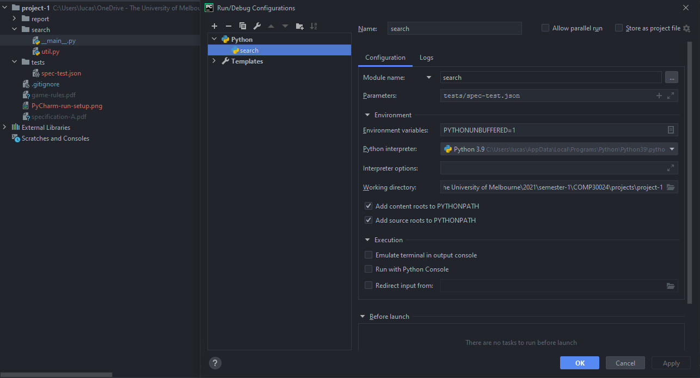

# Project 1
## Search Module
To run the module correctly we can either call `python -m search <test file>` from the command line, or setup our IDE to do it for us. 

Here is a working Run/Debug configuration for this directory structure in PyCharm.

